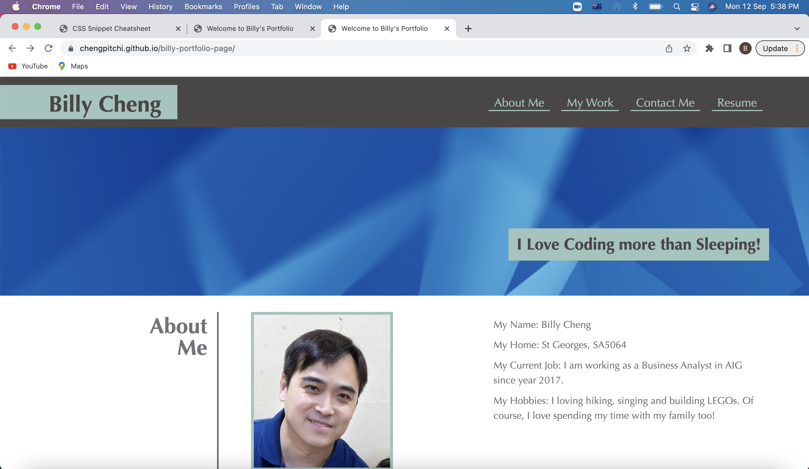
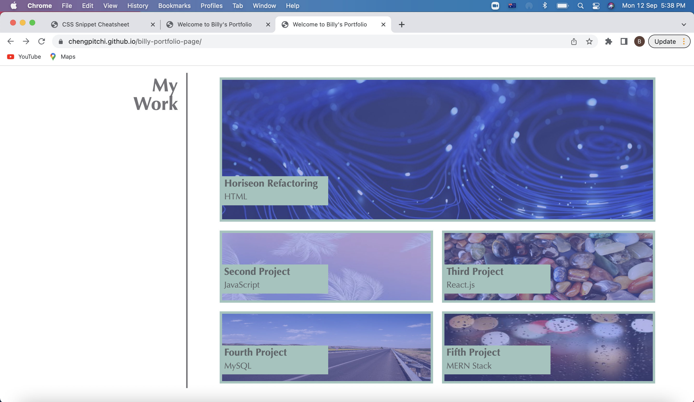
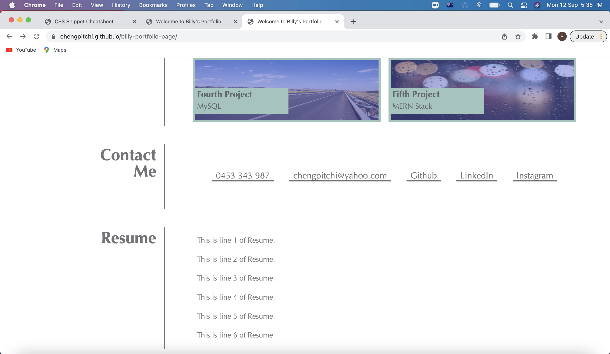

# My Professional Portfoilo 

## Description

This is the Challenge after completing the Unit 2 (Advanced CSS) of Adelaide University Coding Bootcamp. 

## User Story

```
AS AN employer
I WANT to view a potential employee's deployed portfolio of work samples
SO THAT I can review samples of their work and assess whether they're a good candidate for an open position
```

## Acceptance Criteria

Here are the critical requirements necessary to develop a portfolio that satisfies a typical hiring manager’s needs:

```
GIVEN I need to sample a potential employee's previous work
WHEN I load their portfolio
THEN I am presented with the developer's name, a recent photo or avatar, and links to sections about them, their work, and how to contact them
WHEN I click one of the links in the navigation
THEN the UI scrolls to the corresponding section
WHEN I click on the link to the section about their work
THEN the UI scrolls to a section with titled images of the developer's applications
WHEN I am presented with the developer's first application
THEN that application's image should be larger in size than the others
WHEN I click on the images of the applications
THEN I am taken to that deployed application
WHEN I resize the page or view the site on various screens and devices
THEN I am presented with a responsive layout that adapts to my viewport
```

## Solution 

```
Steps to resolve the tasks:
1. Create the HTML file and respective CSS files.  Create the layout of the webpage by editing the HTML files and CSS files. 

2. Adding images to the webpages. 

3. Adding links to the navigation items and my work images

4. Create Pseudo-Classs for the navigation items and my work images. 

5. Adding responsive design to the webpage. 
```

## How to review the solution

1. Click the Github Page link https://chengpitchi.github.io/billy-portfolio-page/ to open the page in Chrome browser. On the page, right click "Inspect" to review the code in Chrome browser Dev Mode.  Use the Wave tool to evaluate the accessibilty of the website. 

2. Click the Github repository link https://github.com/chengpitchi/billy-portfolio-page to examine the files in the repository.

## Live URL 

https://chengpitchi.github.io/billy-portfolio-page/

## Screenshots for the Solution 


<br>

<br>

<br>

## Installation 

No installation required. 

## License 

No Applicable  

